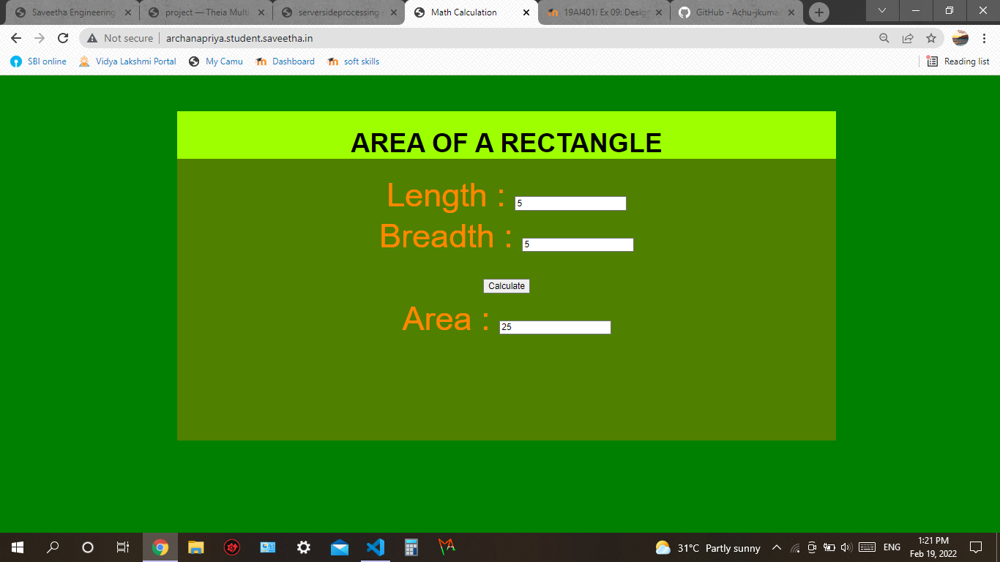

# Design a Website for Server Side Processing

## AIM:
To design a website to perform mathematical calculations in server side.

## DESIGN STEPS:

### Step 1:</br>
In views.py define a function areacalculation.

### Step 2:</br>
Use request.method and write a code to perform calculations.
### Step 3:</br>
Include the URLconf in urls.py .

### Step 4:</br>
Create a newproject "mathapp" inside the django folder.
### Step 5:</br>
Create a html file and perform code operations of finding the area of a rectangle.
### Step 6:</br>
Publish the website in the given URL.

## PROGRAM :
### Area.html coding:
```
<!DOCTYPE html>
<html>
<head>
    <meta charset='utf-8'>
    <meta http-equiv='X-UA-Compatible' content='IE=edge'>
    <title>Math Calculation</title>
    <meta name='viewport' content='width=device-width, initial-scale=1'>
    <script src='main.js'></script>
    <style>
        * {
  box-sizing: border-box;
  font-family: Arial, Helvetica, sans-serif;
}
body {
  background-color: green;
}
.container {
  width: 1080px;
  margin-left: auto;
  margin-right: auto;
  padding-top: 20px;
  padding-bottom:50px;
  padding-left: 50px;
}
.content {
  display:block;
  width: 1000px;
  min-height: 500px;
  font-size: 20px;
  background-color:rgb(79, 128, 0);
}
h1{
    background-color: rgb(157, 255, 0);
    text-align: center;
    padding-top: 25px;
}
.formelement{
    color: rgb(255, 136, 0);
    text-align: center;
    margin-top: 5px;
    margin-bottom: 5px;
    font-size:50px;
}
    </style>
</head>
<body>
    <div class="container">
    <div class="content">
    <h1>AREA OF A RECTANGLE</h1>
    <form method="POST">
        
        <div class="formelement">
        Length : <input type="text" name="length" value="{{l}}"></input><br/>
        </div>
        <div class="formelement">
        Breadth : <input type="text" name="breadth" value="{{b}}"></input><br/>
        </div>
        <div class="formelement">
        <input type="submit"  value="Calculate"></input><br/>
        </div>
        <div class="formelement">
       Area : <input type="text" name="area" value="{{area}}"></input><br/>
        </div>
    
    </form>
    </div>
    </div>
</body>
</html>
```
### urls.py:
```
"""calculation URL Configuration

The `urlpatterns` list routes URLs to views. For more information please see:
    https://docs.djangoproject.com/en/3.1/topics/http/urls/
Examples:
Function views
    1. Add an import:  from my_app import views
    2. Add a URL to urlpatterns:  path('', views.home, name='home')
Class-based views
    1. Add an import:  from other_app.views import Home
    2. Add a URL to urlpatterns:  path('', Home.as_view(), name='home')
Including another URLconf
    1. Import the include() function: from django.urls import include, path
    2. Add a URL to urlpatterns:  path('blog/', include('blog.urls'))
"""
from django.contrib import admin
from django.urls import path
from mathapp import views

urlpatterns = [
    path('admin/', admin.site.urls),
    path('areaofrectangle/',views.areacalculation,name="areaofrectangle"),
    path('',views.areacalculation,name="areaofrectangleroot")
]
```
### views.py:
```
from django.shortcuts import render

# Create your views here.
def areacalculation(request):
    context={}
    context['area'] = "0"
    context['l'] = "0"
    context['b'] = "0"
    if request.method == 'POST':
        l = request.POST.get('length','0')
        b = request.POST.get('breadth','0')
        area = int(l) * int(b)
        context['area'] = area
        context['l'] = l
        context['b'] = b
    return render(request,'mathapp/area.html',context)
```

## OUTPUT:



## Result:
 A website to perform mathematical calculations in server side has been successfully designed.

